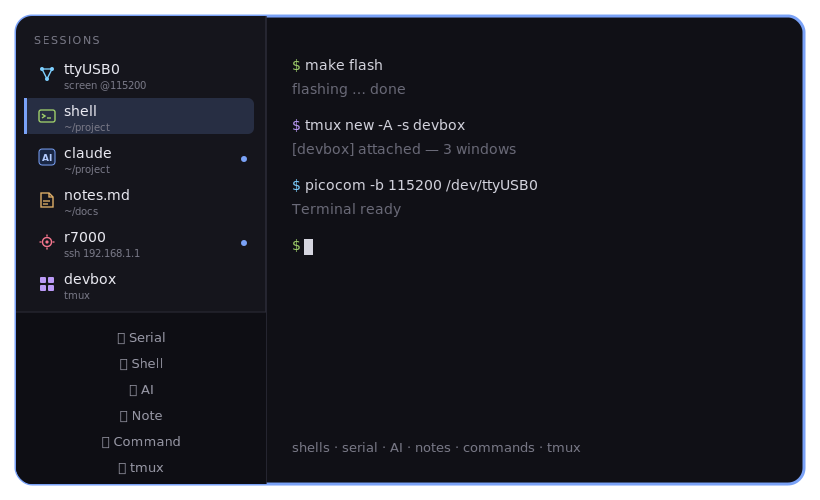

# tabit

**v1.4.2** — a terminal built around a **left tab sidebar**.

<p align="center">
  
</p>

Every session lives as a **color-coded tab down the left edge** of a single
window — a shell, a serial console, an AI CLI, a note (GtkSourceView +
Markdown preview), an arbitrary command, or a tmux session. Click to switch,
drag to reorder, double-click to rename. Real terminals throughout, powered
by the VTE engine.

One small Python file. No pip packages, no compiling — everything comes
from the Ubuntu archive.

## Requirements

- Linux with GTK3 + VTE + GtkSourceView 4 (X11 or Wayland)
- WebKit2 + `python3-markdown` for note Markdown preview
- `picocom` for serial sessions
- Tested on Ubuntu / Xubuntu

## Install

```sh
git clone https://github.com/ChrisLi826/tabit.git
cd tabit
./install.sh      # installs deps via apt, copies to ~/.local/bin, adds app menu entry
~/.local/bin/tabit &
```

To remove: `./install.sh --uninstall`

## Usage

| Action | Result |
|---|---|
| `+ Serial` | Pick device, baud (default 115200), and tool: `screen` (bundled `screen.sh`) / `kermit` / `picocom`; or `ssh` / `telnet` to a host + port (for network console servers) |
| `+ Shell` | New tab running your login shell |
| `+ AI` | Pick AI CLI and working directory. **Edit list…** manages CLI names and per-CLI continue/resume tries (`~/.config/tabit/ai_clis.json`) |
| `+ Note` | GtkSourceView editor + **Markdown Preview** (WebKit); bottom tools: Base64 / JSON Format; wrap in **Settings…**; huge-line guards |
| `Settings…` | Note wrap default and other prefs (`settings.json`) |
| `+ Command` | Run anything (e.g. `ssh root@192.168.1.1`) in a new tab |
| `+ tmux` | Attach to a running tmux session or create one; rename / kill sessions from the list |
| Click a tab | Switch to that session |
| Double-click a tab / right-click → Rename… / `F2` | Rename (popover bubble to the right of the tab) |
| `x` on a tab (shown on hover) | Close that session |
| `Ctrl+Shift+S` / `Ctrl+Shift+T` / `Ctrl+Shift+A` / `Ctrl+Shift+N` | New serial / shell / AI / note |
| `Ctrl+S` | Save note (when a note tab is selected) |
| `Ctrl+Alt+B` / `Ctrl+Alt+Shift+B` | Note Base64 encode / decode |
| `Ctrl+Alt+J` | Note JSON format (also validates) |
| `Ctrl+Alt+M` | Note Markdown preview toggle |
| `Ctrl+Shift+W` | Close current session |
| `Ctrl+PageUp` / `Ctrl+PageDown` | Previous / next session |
| `Ctrl+Shift+PageUp` / `Ctrl+Shift+PageDown` | Move current tab up / down |
| `Ctrl+Shift+C` / `Ctrl+Shift+V` | Copy / paste |
| `Shortcuts…` (sidebar) | Edit any of the shortcuts above |

A blue dot on a tab means that session printed output while you were
looking elsewhere. When a session's process ends (device unplugged,
`exit`, picocom quit) the tab stays, greyed and marked `exited`, so
you keep the scrollback — press its `x` to really close it.

Serial tool defaults to `screen` — a bundled `screen.sh` wrapper
(multi-attach + logfile), written to `~/.config/tabit/screen.sh`. `kermit`
uses `~/senaoenv/kermrc` when present (`-c -E`). `picocom` quit is
`Ctrl-A Ctrl-X`. Closing the last tab quits tabit.

Tabs are remembered: the next start restores the same set of sessions
as fresh processes (serial consoles reconnect, shells start clean —
scrollback is not kept). Stored in `~/.config/tabit/sessions.json`.

Keyboard shortcuts are editable via **Shortcuts…** in the sidebar
(or hand-edit `~/.config/tabit/keys.json`). Defaults match the table
above; **Reset defaults** in the dialog restores them.

## Roadmap

- File browser pane + text editing tabs
- Saved session profiles (named serial/ssh setups)

## License

MIT
