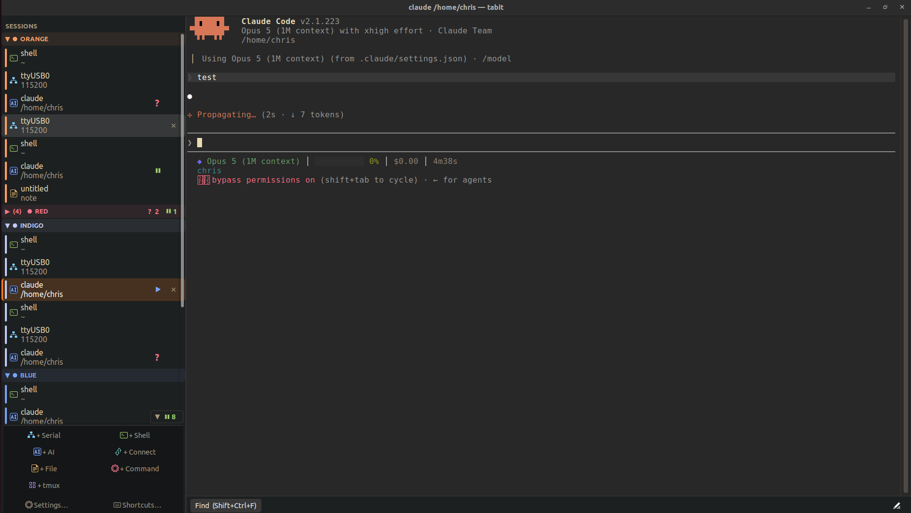

# tabit

[](https://github.com/ChrisLi826/tabit/releases/latest)
[](LICENSE)

**tabit** is a Linux GTK terminal where every session — a shell, a serial
console, an AI CLI, or a note — is a **color-coded tab down the left edge**
of one window.

<p align="center">
  
</p>

- **Serial consoles** — USB-serial, `screen` multi-attach, kermit, picocom;
  group devices by project color and collapse what you are not using
- **Multi-AI status** — Claude / Codex / Grok (and more): ▶ working ·
  || idle · ? needs input · ✔ done; off-viewport peeks and
  collapsed-group summaries
- **Native GTK + VTE** — no Electron, no pip; install from the Ubuntu archive
  with one script

## Install

```sh
git clone https://github.com/ChrisLi826/tabit.git
cd tabit
./install.sh      # apt deps + ~/.local/bin/tabit + app menu entry
~/.local/bin/tabit &
```

To remove: `./install.sh --uninstall`

In-app **Check for updates** can pull and reinstall (may ask for your sudo
password for apt).

## Requirements

- Linux with GTK3 + VTE + GtkSourceView 4 (X11 or Wayland)
- WebKit2 + `python3-markdown` for note Markdown preview
- `picocom` for serial sessions
- Tested on Ubuntu / Xubuntu

## Usage

| Action | Result |
|---|---|
| `+ Serial` | Pick device, baud (default 115200), and tool: `screen` (bundled `screen.sh`) / `kermit` / `picocom`; or `ssh` / `telnet` to a host + port (for network console servers) |
| `+ Shell` | New tab running your login shell |
| `+ AI` | Pick AI CLI and working directory; an optional **Session ID** resumes that exact session (tried first, normal continue/resume stays as fallback). **Run inside tmux** keeps the agent alive across restarts and lists the ones still running. **Edit list…** manages CLI names and per-CLI continue/resume tries (`~/.config/tabit/ai_clis.json`) |
| `+ Note` | GtkSourceView editor + **Markdown Preview** (WebKit); bottom tools: Base64 / JSON Format; wrap in **Settings…**; huge-line guards |
| `Settings…` | Note wrap default and other prefs (`settings.json`) |
| `+ Command` | Run anything (e.g. `ssh root@192.168.1.1`) in a new tab |
| `+ tmux` | Attach to a running tmux session or create one; rename / kill sessions from the list |
| Click a tab | Switch to that session |
| Double-click a tab / right-click → Rename… / `F2` | Rename (popover bubble to the right of the tab) |
| `x` on a tab (shown on hover) | Close that session |
| `Ctrl+Shift+S` / `Ctrl+Shift+T` / `Ctrl+Shift+A` / `Ctrl+Shift+N` | New serial / shell / AI / note |
| `Ctrl+S` | Save note (when a note tab is selected) |
| `Ctrl+Alt+B` / `Ctrl+Alt+Shift+B` | Note Base64 encode / decode |
| `Ctrl+Alt+J` | Note JSON format (also validates) |
| `Ctrl+Alt+M` | Note Markdown preview toggle |
| `Ctrl+Shift+W` | Close current session |
| `Ctrl+PageUp` / `Ctrl+PageDown` | Previous / next session |
| `Ctrl+Shift+PageUp` / `Ctrl+Shift+PageDown` | Move current tab up / down |
| `Ctrl+Alt+R` | Toggle the right content pane (two sessions side by side) |
| `Ctrl+Alt+P` | Pin the selected session to the right pane |
| `Ctrl+Tab` | Move focus between the left and right pane |
| `Ctrl+Alt+W` | Swap what the left and right panes show |
| `Ctrl+Shift+C` / `Ctrl+Shift+V` | Copy / paste |
| `Shortcuts…` (sidebar) | Edit any of the shortcuts above |

A blue dot on a tab means that session printed output while you were
looking elsewhere. When a session's process ends (device unplugged,
`exit`, picocom quit) the tab stays, greyed and marked `exited`, so
you keep the scrollback — press its `x` to really close it.

Serial tool defaults to `screen` — a bundled `screen.sh` wrapper
(multi-attach + logfile), written to `~/.config/tabit/screen.sh`. `kermit`
uses `~/senaoenv/kermrc` when present (`-c -E`). `picocom` quit is
`Ctrl-A Ctrl-X`. Closing the last tab quits tabit.

Tabs are remembered: the next start restores the same set of sessions
as fresh processes (serial consoles reconnect, shells start clean —
scrollback is not kept). Stored in `~/.config/tabit/sessions.json`.

An AI tab can instead **run inside tmux** (tick it in **+ AI**): the agent
keeps running when tabit closes, and reopening the tab reattaches to the
turn it was in the middle of, rather than replaying the conversation with
`--continue`. **+ AI** lists the AI sessions still running — CLI, folder,
and whether a tab is attached — so a detached agent can be picked back up
or killed. tabit sets `status off`, window-title passthrough and prefix
`C-a` on those sessions, so the AI status icons keep working and `Ctrl+B`
still reaches the agent.

Two sessions can share the window: `Ctrl+Alt+R` opens a **right content
pane**, `Ctrl+Alt+P` pins the selected tab there. Drag the divider to
resize; the split and the pinned session come back on the next start. Each
pane has a small header with an `L` / `R` badge and an `x` that closes only
that pane — closing the right pane keeps the left one full width, closing
the left one promotes the right session. The tab list can sit **left,
right, or between the two panes** (**Settings… → Tab list position**).

With three columns on screen, the middle one can be nudged sideways: drag
its header — the tab list's **SESSIONS** bar when the list is centered, or
the `L` / `R` bar when the list is parked on an edge. The middle column
keeps its width and the two outer ones trade. Every drag stops where a
neighbour hits its minimum, so the left and right window edges stay put.

Keyboard shortcuts are editable via **Shortcuts…** in the sidebar
(or hand-edit `~/.config/tabit/keys.json`). Defaults match the table
above; **Reset defaults** in the dialog restores them.

## Where tabit fits

If you already use **tmux** or **Tilix**, keep them for session persistence
inside a host and for many-way tiling. tabit is a **session dock**: many
independent VTE terminals (and notes) as one tab list, with any two of them
side by side when you need it — especially when you juggle **serial
boards**, **SSH consoles**, and **several AI CLIs** and want at-a-glance
status without tiling windows by hand.

## Roadmap

- File browser pane + text editing tabs
- Saved session profiles (named serial/ssh setups)

## License

MIT
